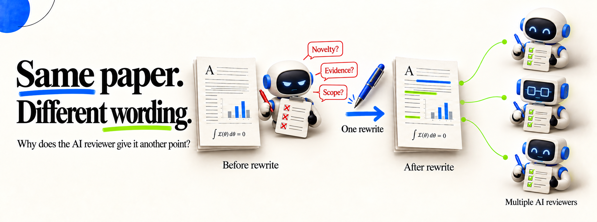
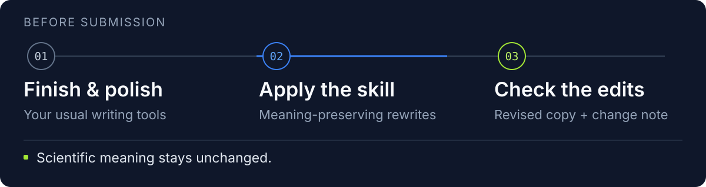

<h1 align="center">📝 Game the LLM Reviewer</h1>

<p align="center">
  <a href="README.md">English / 中文</a> ·
  <a href="README.ja.md">日本語</a> ·
  <a href="README.ar.md">العربية</a> ·
  <a href="README.es.md">Español</a> ·
  <a href="README.de.md">Deutsch</a> ·
  <a href="README.fr.md">Français</a>
</p>

<p align="center">
  <a href="https://github.com/Michael-Jiahao-Zhang/game-the-llm-reviewer/releases"></a>
  <a href="LICENSE"></a>
</p>



Game the LLM Reviewer turns findings from studies of LLM review preferences into an **agent-compatible skill** for a final editing pass before submission. It makes small wording changes while preserving the paper's scientific meaning.

> 我们整理了 LLM 审稿偏好的相关研究，提炼出 **LLM agent 可以直接使用的 skill**，用于投稿前的最后一轮润色。


<p align="center">
  <a href="#-quick-start"><strong>Quick start</strong></a> ·
  <a href="#-before-and-after"><strong>Before / after</strong></a> ·
  <a href="skills/game-the-llm-reviewer/references/strategies.md"><strong>Strategies</strong></a> ·
  <a href="skills/game-the-llm-reviewer/references/research.md"><strong>Research</strong></a>
</p>

> **既然我们无法彻底避开 LLM 审稿，那干脆利用它们的偏好来保护我们的研究成果。**

We oppose handing peer-review decisions over to LLMs, but authors often have little say in whether a reviewer uses one. Papers should be judged on the soundness of their methods, the strength of their evidence, and the substance of their contributions. Yet studies have found that rephrasing the same passage can change an LLM reviewer's score.

> 论文的评价应基于方法是否可靠、证据是否充分、贡献是否扎实。但已有研究发现，LLM 审稿人对论文同一段话换个措辞就会打出不同的分。

This skill provides a final, defensive editing pass after ordinary polishing. It selects wording that aligns with documented LLM reviewer preferences while preserving meaning and keeping the scientific assessment a human reviewer could make materially unchanged. It requires no knowledge of the reviewer model and does not query it.

> 这个工具是投稿前的最后一道“防御性润色”：我们根据 LLM 审稿偏好的研究，在意思完全不变的几种说法里将论文改写成 LLM reviewer 更青睐的那种，而这种改动对人类审稿人来说几乎没有区别。

<!-- Keep the alert separate from the translated blockquote. -->

> [!IMPORTANT]
> ⚠️ **Academic integrity**
>
> Edits must preserve the paper's claims and supporting evidence, including citations, assumptions, uncertainty, and substantive limitations. Record each change. Fabricated results, inflated novelty, concealed weaknesses, and hidden instructions to reviewers are outside the skill's scope.
>
> Authors remain responsible for the manuscript and for following their venue's rules on AI assistance and disclosure.

<!-- End of academic integrity alert. -->

> **写论文 → 跑你常用的写作工具 → 最后跑一遍 Game-the-LLM-Reviewer。**

---

## 🚀 Quick start

<picture>
  <source media="(max-width: 600px)" srcset="assets/readme/workflow-mobile.svg">
  
</picture>

<!-- Agent icons: https://github.com/lobehub/lobe-icons -->
<p align="center">Works with</p>
<p align="center">
  <picture><source media="(prefers-color-scheme: dark)" srcset="https://raw.githubusercontent.com/lobehub/lobe-icons/2e76c48721e91b9aaa40803a0fa2eb8aca7399c4/packages/static-png/dark/claudecode-color.png"></picture>&nbsp;<strong>Claude&nbsp;Code</strong> &nbsp; · &nbsp;
  <picture><source media="(prefers-color-scheme: dark)" srcset="https://raw.githubusercontent.com/lobehub/lobe-icons/2e76c48721e91b9aaa40803a0fa2eb8aca7399c4/packages/static-png/dark/codex-color.png"></picture>&nbsp;<strong>Codex</strong> &nbsp; · &nbsp;
  <picture><source media="(prefers-color-scheme: dark)" srcset="https://raw.githubusercontent.com/lobehub/lobe-icons/2e76c48721e91b9aaa40803a0fa2eb8aca7399c4/packages/static-png/dark/cursor.png"></picture>&nbsp;<strong>Cursor</strong> &nbsp; · &nbsp;
  <picture><source media="(prefers-color-scheme: dark)" srcset="https://raw.githubusercontent.com/lobehub/lobe-icons/2e76c48721e91b9aaa40803a0fa2eb8aca7399c4/packages/static-png/dark/antigravity-color.png"></picture>&nbsp;<strong>Antigravity</strong>
</p>
<p align="center">
  <picture><source media="(prefers-color-scheme: dark)" srcset="https://raw.githubusercontent.com/lobehub/lobe-icons/2e76c48721e91b9aaa40803a0fa2eb8aca7399c4/packages/static-png/dark/githubcopilot.png"></picture>&nbsp;<strong>GitHub&nbsp;Copilot</strong> &nbsp; · &nbsp;
  <picture><source media="(prefers-color-scheme: dark)" srcset="https://raw.githubusercontent.com/lobehub/lobe-icons/2e76c48721e91b9aaa40803a0fa2eb8aca7399c4/packages/static-png/dark/opencode.png"></picture>&nbsp;<strong>OpenCode</strong> &nbsp; · &nbsp;
  <picture><source media="(prefers-color-scheme: dark)" srcset="https://raw.githubusercontent.com/lobehub/lobe-icons/2e76c48721e91b9aaa40803a0fa2eb8aca7399c4/packages/static-png/dark/kimi-color.png"></picture>&nbsp;<strong>Kimi&nbsp;Code&nbsp;CLI</strong> &nbsp; · &nbsp;
  <picture><source media="(prefers-color-scheme: dark)" srcset="https://raw.githubusercontent.com/lobehub/lobe-icons/2e76c48721e91b9aaa40803a0fa2eb8aca7399c4/packages/static-png/dark/trae-color.png"></picture>&nbsp;<strong>TraeCode</strong> &nbsp; · &nbsp;
  <picture><source media="(prefers-color-scheme: dark)" srcset="https://raw.githubusercontent.com/lobehub/lobe-icons/2e76c48721e91b9aaa40803a0fa2eb8aca7399c4/packages/static-png/dark/qwen-color.png"></picture>&nbsp;<strong>Qwen&nbsp;Code</strong>
</p>
<p align="center">and other <a href="https://github.com/vercel-labs/skills#supported-agents">Agent Skills-compatible agents</a>.</p>

### 1. Install the skill

**Ask your coding agent to install the skill:**

```text
Clone this repository and install its game-the-llm-reviewer skill:
https://github.com/Michael-Jiahao-Zhang/game-the-llm-reviewer
```

Or install with [Skills CLI](https://github.com/vercel-labs/skills):

```sh
npx skills add Michael-Jiahao-Zhang/game-the-llm-reviewer --skill game-the-llm-reviewer
```

### 2. Apply it to your manuscript

Give your agent a finished manuscript:

```text
Use game-the-llm-reviewer on paper/main.tex. Read the included sections first.
Apply small, meaning-preserving edits targeting LLM reviewer preferences.
Keep the scientific assessment a human could make unchanged.
Save a revised copy and changes.md explaining each rhetorical change.
```

The agent saves a **revised copy** and a **change note** explaining the edits. It works with your existing writing setup and requires no additional reviewer API.

<details>
<summary>Agent-specific installation, private access, and manual use</summary>

To select an agent explicitly:

```sh
npx skills add Michael-Jiahao-Zhang/game-the-llm-reviewer --skill game-the-llm-reviewer -a claude-code
npx skills add Michael-Jiahao-Zhang/game-the-llm-reviewer --skill game-the-llm-reviewer -a codex
```

Run the command for your agent. Installs are project-local by default; add `-g` for a personal installation. The installer requires Node.js (check its [current requirements](https://github.com/vercel-labs/skills/blob/main/package.json)). Private repositories require GitHub access and configured Git, GitHub CLI, or SSH authentication.

For manual use, clone the repository and ask any file-capable writing agent to read the skill:

```sh
git clone https://github.com/Michael-Jiahao-Zhang/game-the-llm-reviewer.git
cd game-the-llm-reviewer
```

```text
Read skills/game-the-llm-reviewer/SKILL.md and apply it to my finished manuscript.
Return a revised copy and a compact change note.
```

For manual installation, copy the **whole** `skills/game-the-llm-reviewer/` folder into your agent’s supported skills directory, including its references. Inspect an existing installation before replacing it. The skill itself has no runtime dependencies; file handling and LaTeX compilation use your agent’s available tools.

</details>

## ✨ Before and after

This example is a contribution overview from an introduction about **execution memory for coding agents**.

### Before

> Coding agents can lose track of failed repair attempts as tool outputs accumulate. **We propose an execution memory** that records attempted patches and their test outcomes for use in subsequent steps, without updating model weights. On 300 Python repository issues with two backbone models and a fixed per-issue token budget, the memory-equipped agent resolves 34% and 39% of issues, compared with 30% and 35% for the same agents without memory, respectively.

### After Game the LLM Reviewer

> **We introduce an execution memory for coding agents that requires no model weight updates.** It records attempted patches and their test outcomes for use in subsequent steps, addressing the loss of failed-attempt history as tool outputs accumulate. On 300 Python repository issues with two backbone models and a fixed per-issue token budget, execution memory **increases issue resolution by 4 percentage points for each model**, from 30% to 34% and from 35% to 39%, respectively.

### What changed

| Strategy | What changes |
|---|---|
| **S1 · Contribution stance** | Move the existing no-weight-update property into the opening description of the method |
| **S2 · Evidence framing** | Express the same resolution rates as 4-percentage-point gains, retaining both baseline and final rates |
| **S3 · Abstract emphasis** | Lead with the contribution, then retain the existing problem context |

Both versions describe the same method and evaluation. The revision foregrounds the contribution and expresses the existing rate differences in percentage points. See the [strategy cards](skills/game-the-llm-reviewer/references/strategies.md) for details.

<details>
<summary>Try it on the included coding agent example</summary>

From the repository root, give your agent:

```text
Read skills/game-the-llm-reviewer/SKILL.md and apply it to examples/coding-agent-introduction.md.
Save introduction.revised.md and introduction.changes.md.
```

Compare the output with the before/after example above.

</details>

### 📊 Selected score increases on real papers

These are **already well-written papers describing excellent work**. Each edit below changes a small phrase while keeping the scientific content intact.

| Paper / section | Before (excerpt) | After (excerpt) | Score / 10 |
|---|---|---|---:|
| [ToolLLM](https://arxiv.org/abs/2307.16789) · Abstract | “to evaluate …, we develop an automatic evaluator: ToolEval” | “we develop ToolEval, an automatic evaluator, to evaluate …” | **6 → 7** |
| [API-Bank](https://arxiv.org/abs/2304.08244) · Abstract | “Lynx surpasses Alpaca's tool utilization performance by more than 26 pts” | “relative to Alpaca, Lynx improves tool utilization performance by more than 26 pts” | **6 → 7** |
| [WebArena](https://arxiv.org/abs/2307.13854) · Introduction | “We focus on evaluating the functional correctness” | “Our evaluation focuses on the functional correctness” | **7 → 8** |

ToolLLM and WebArena shift grammatical focus (**S1**); API-Bank reframes the same baseline comparison (**S2**). All other text in each evaluated section stays unchanged.

**Setup:** Selected examples scored by GPT-6 ASTRA on a 10-point scale, with one independent score per version of the abstract or introduction. The rewriter received no reviewer feedback.

## 🎯 Using it with other writing tools

Run this skill once the draft and ordinary polishing are complete. It can follow an existing writing workflow, including those provided by these projects:

| Project | How it fits |
|---|---|
| [AutoResearchClaw](https://github.com/aiming-lab/AutoResearchClaw) | Produces a paper through an automated research pipeline; apply this skill to the finished draft. |
| [Scientific Agent Skills](https://github.com/K-Dense-AI/scientific-agent-skills) / [AI Research Skills](https://github.com/Orchestra-Research/AI-Research-SKILLs) | Provide broader research and writing tools that can be used earlier in the process. |
| [Research Paper Writing Skills](https://github.com/Master-cai/Research-Paper-Writing-Skills) / [Claude Scholar](https://github.com/Galaxy-Dawn/claude-scholar) | Cover drafting and revision; apply this skill after those edits are complete. |
| [ARGAR](https://github.com/xyimatvoid/ARGAR) | Optimizes presentation through repeated AI-review feedback. This skill instead applies a prepared set of editing strategies without a reviewer feedback loop. |

## 🛠️ Editing strategies

| Rhetorical dimension | Meaning-preserving operation |
|---|---|
| **S1 · Contribution stance** | Express the same established contribution through a different grammatical emphasis |
| **S2 · Evidence framing** | Rephrase the same numerical comparison as a measured effect |
| **S3 · Abstract emphasis** | Change the order or emphasis of existing statements without adding an explanation |
| **S4 · Lexical stance** | Adjust non-factual evaluative wording while preserving certainty |
| **S5 · Scope framing** | Rephrase the same evaluated and unevaluated scope without reducing the limitation |
| **S6 · Equivalence check** | Check that the edits leave claims, evidence, and scientific implications intact |

Each [strategy card](skills/game-the-llm-reviewer/references/strategies.md) describes when to use an edit and what to preserve. The agent chooses applicable edits from S1–S5, then uses S6 to check them against the original. It can leave a passage unchanged.

<details>
<summary>Ready-to-use prompts: abstract, theory, or an already-polished paper</summary>

**Abstract only**

```text
Use game-the-llm-reviewer on this abstract, keeping it under 200 words.
Work only from the supplied text and preserve both positive and negative results.
Return replacement prose and a short change note.
```

**Theory paper**

```text
Use game-the-llm-reviewer on paper/main.tex. Adjust contribution stance without
changing its scientific meaning. Preserve theorem assumptions, quantifiers,
and the distinction between an upper bound and an optimal rate.
```

**After another writing skill**

```text
The draft is already polished. Use game-the-llm-reviewer as the final pass.
Reuse the attached claim–evidence map, checking it against the manuscript.
Use the included strategies to select small wording changes for LLM review preferences.
Keep the meaning and scientific assessment unchanged; do not rewrite just for style.
```

</details>

## 📦 Output

The output includes a revised manuscript and a change note. For a short excerpt, the agent can return replacement text and explain the changes inline. A change note looks like this:

| Passage | Strategy / rationale | Meaning held fixed |
|---|---|---|
| Introduction opening and results | S1/S3: contribution first; S2: resolution gains | Same execution memory, unchanged model weights, 300 Python issues, two models, token budget, and resolution rates |

The note briefly explains the main changes and flags any source issues that need your attention. For LaTeX projects, the agent preserves file relationships and compiles the revision when a suitable toolchain is available.

## 📚 References

The [research notes](skills/game-the-llm-reviewer/references/research.md) summarize these papers and map their findings to the editing strategies:

- [How Can Rhetoric Reward-Hack AI Reviewers?](https://arxiv.org/abs/2608.08975) examines which rhetorical dimensions affect reviews.
- [No Hidden Prompts Needed!](https://arxiv.org/abs/2606.13044) studies presentation-only revisions using ARGAR.
- [Gaming AI-Assisted Peer Reviews](https://arxiv.org/abs/2606.10159) studies abstract rephrasing.
- [LLM-REVal](https://arxiv.org/abs/2510.12367) compares human and LLM writing preferences.
- [Are We There Yet?](https://arxiv.org/abs/2412.01708) examines review failures, including responses to disclosed limitations.

## 🤝 Contributing

Corrections and additional wording examples are welcome. Please include the source or reasoning behind a proposed strategy change; see [CONTRIBUTING.md](CONTRIBUTING.md).

---

[MIT license](LICENSE) for this project's original files. Referenced research, datasets, and upstream code retain their own licenses. This project is independent of the cited authors.
