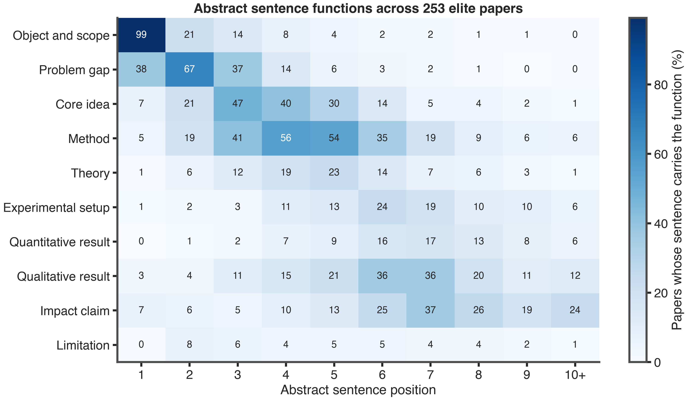
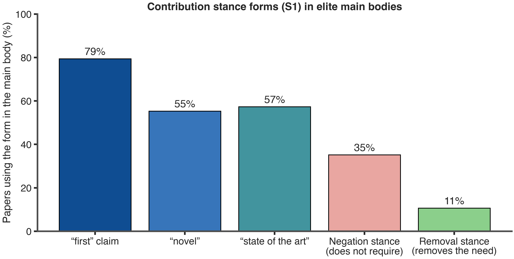
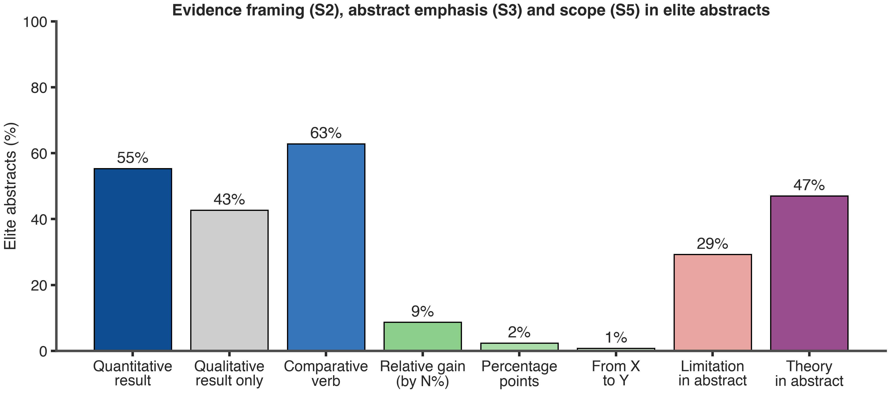
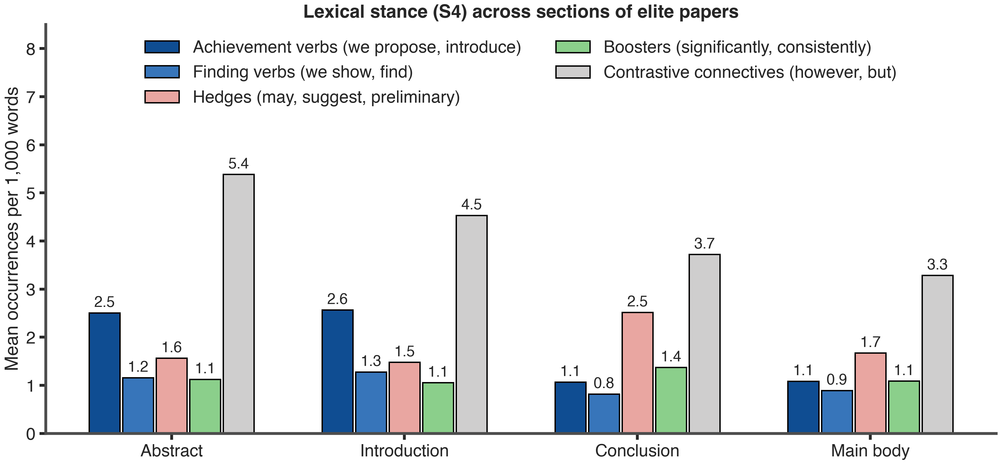

# Elite-corpus priors

The strategy cards in [strategies.md](strategies.md) describe rhetorical cues that LLM reviewers respond to. This card records how accepted top-tier papers already use those cues, measured over 253 oral, spotlight and outstanding papers from ICLR 2026 (153) and ICML 2026 (100). The measurement reads each paper's canonical PDF text and its sentence-level abstract annotation, applies fixed lexical patterns, and reports shares of papers and densities per 1,000 words. Every number below is reproducible from `corpus/measure_rhetoric.py`, and the figures come from `corpus/make_figures.py` in the figures4papers house style.

Use these priors to decide how far an edit can move a manuscript while it stays inside the range of accepted writing. A prior describes the population of accepted papers. It carries no claim that a form causes acceptance, and it never overrides S6.

## E1 · Abstract layout (S3)



- Elite abstracts hold a median of 8 sentences (interquartile range 7 to 9).
- Sentence 1 states the object and scope in 99% of abstracts; 43% open with scope alone and 36% open with scope plus the problem gap.
- The problem gap peaks at sentence 2 (67% of papers), the core idea at sentence 3 (47%), and the method at sentences 4 and 5 (56% and 54%).
- The first sentence carrying the core idea or method sits at position 3 (median; interquartile range 2 to 4), which is 29% of the way through the abstract.
- The first result sentence sits 68% of the way through the abstract (median); impact claims peak at sentence 7 (37%).

**Reading for S3.** Moving a contribution ahead of sentence 2 places the abstract outside the layout of 90% of elite papers. A reordering that lands the core idea at sentence 2 or 3, after one scope sentence, stays inside the common layout.

## E2 · Contribution stance (S1)



- 79% of elite main bodies contain a “first” claim (“the first”, “first to”, “for the first time”); 55% use “novel”; 57% use “state of the art”.
- 35% express a contribution through a negated requirement (“does not require”, “without relying on”); 11% express it through a removal statement (“removes the need”, “eliminates the assumption”).
- Achievement verbs (“we propose”, “we introduce”) run at a mean of 2.5 per 1,000 words in abstracts and 2.6 in introductions; finding verbs (“we show”, “we find”) run at 1.2 and 1.3.

**Reading for S1.** Priority words are common in accepted papers, and S1 still holds its rule: the edit adds no “first” claim the source fails to support. The negated-requirement form is the majority form among the two S1 templates, so recasting it into a removal statement is a recognisable minority form; keep the comparator and conditions when doing so.

## E3 · Evidence framing (S2)



- 55% of elite abstracts carry a quantitative result sentence; 43% report results in qualitative terms only.
- 63% of abstracts use a comparative verb (“outperforms”, “improves”, “reduces”); 9% state a relative gain (“by 12%”); 2% state a percentage-point difference; 1% use a from-to pair.
- Comparative verbs run at 1.9 per 1,000 words in abstracts and 2.5 in conclusions.

**Reading for S2.** The comparison-to-effect template is a small change inside a population where the comparative-verb form dominates. A derived percentage-point restatement is rare in elite abstracts, so prefer the original values with a comparative verb, and add a derived difference only when the arithmetic is verified and the original values stay in the sentence.

## E4 · Lexical stance (S4)



- Hedges (“may”, “suggest”, “preliminary”) run at a mean of 1.6 per 1,000 words in abstracts, 1.5 in introductions and 2.5 in conclusions; the median abstract contains none.
- Boosters (“significantly”, “consistently”) run at 1.1 per 1,000 words in abstracts and 1.4 in conclusions.
- Contrastive connectives (“however”, “but”, “although”) run at 5.4 per 1,000 words in abstracts, 4.5 in introductions and 3.3 across the main body.

**Reading for S4.** Hedging is sparse in elite abstracts and concentrated in conclusions, so removing an ornamental hedge from an abstract moves it toward the population median, and removing a hedge from a conclusion moves it away from the population. Boosters stay near one per 1,000 words everywhere; adding boosters exceeds the accepted density quickly.

## E5 · Scope framing (S5)

- 29% of elite abstracts contain a limitation sentence, placed between sentences 2 and 6 in most cases.
- 52% of elite papers carry a section whose title names limitations; 43% of conclusions contain an explicit scope frame (“limited to”, “remains untested”, “future work”, “beyond the scope”).
- 47% of abstracts carry a theory sentence.

**Reading for S5.** Explicit scope statements are standard in accepted papers. Rephrasing a limitation into an evaluated-scope statement keeps the manuscript inside this population when the boundary sentence stays adjacent and explicit.

## Reproduction

```sh
python3 corpus/measure_rhetoric.py --corpus /path/to/elite-ml-paper-anatomy-2026 --output corpus/elite-corpus-rhetoric.json
uv run --script corpus/make_figures.py
```

The measurement depends on the corpus repository `ZenAlexa/elite-ml-paper-anatomy-2026` at the revision recorded in `corpus/elite-corpus-rhetoric.json`; it reads `readings/<paper_id>.json` for abstract sentence functions and `papers/<paper_id>/pages.jsonl` with `document.json` for section text. Lexical patterns are listed at the top of `measure_rhetoric.py`; a pattern counts surface forms, so a hedge inside a quotation or a definition counts as a hedge.
